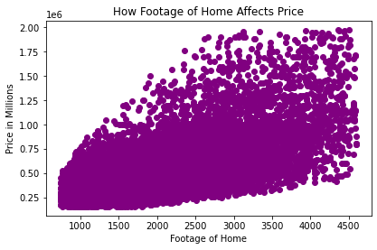

# King County Real Estate Predictive Model

**Authors:** Colette Crowder, Joe Swing, Katherine Skoda 

## Overview

Our goal was to create a predictive model of home prices in King County from data of existing King County homes with as much accuracy as possible. The data we used described numerous features of homes such as number of bedrooms, baths, etc. We narrowed down the data to the variables that would best predict price, cleaned the data, preprocessed it, and created models. Our final model is approximately 85% accurate and has a range of error of 102,000 dollars.

## Business Problem

Through our predictive model, homeowners can figure out how much their homes might sell for or what qualities of a home affect its price. To discover which variables are most important for our predictive model, we looked at the correlations a variety of variables have with price.

## Data

All data came from homes in King County. Data we explored included number of bedrooms, bathrooms, floors, the square footage of living space in a house, the grade given to a house, what kind of view the house has, zip codes, and even more variables that could affect price, our target variable.

## Methods

We cleaned the data by dropping all null values, removing outliers, OneHotEncoding categorical features, and changing all strings into int or float values for easier access. By comparing correlations, we decided which variables to focus on. We created a baseline model, then we preprocessed the data by dropping irrelevant columns and encoding certain variables. We created another model from the baseline that would more effectively predict house prices. 

## Results

Training R2: 0.8503
Testing R2: 0.8467
Training RMSE: 101415.6435
Testing RMSE: 102664.7123

Our final model results gave us a testing R^2 value of .84 and our testing RMSE was brought down from roughly 217,000 dollars to roughly 102,000 dollars. 

This data is specifically focused on King County. The results may not generalize to real estate in other locations.

## Visuals

To figure out which variables are the most useful to include in our model, we compared the strength of their correlations with price. 

Insert Purple scatter plot
We discovered the strongest correlation is between square footage and price.

Insert room vs price
We took a random feature and compared it to price to see its effect. After seeing a very extreme outlier, we decided to drop it. The next visualization is the same scatter plot only without the outlier. 

Katie boxplot

This is a boxplot that shows the price for each data set. 

The next one is the price for each data set without the 1st and 99th quartiles. 

Baseline Model visual
This graph shows our baseline model against a perfect model. 

Price before outliers
This shows our price column with outliers.

Price after outliers
This shows our price column without outliers. 

Joes Model Prediction
This visulation shows a model that is still being improved upon.

Advanced Model
This visual shows our final and most advanced model tested against a perfect model. 

## Conclusions

In the future we hope to create an algorithm that homeowners can use to input specific information about the features of a home and receive an output of a price in return. One limitation with our model is that it will not accurately predict home prices in King County forever because housing markets change. To create the best algorithm possible, we would find a way to constantly pull new data in the future.

## For More Information

Please review our full analysis in our [our Jupyter Notebook](./dsc-phase1-project-template.ipynb) or our [presentation](../images/powerpoint.pdf).
For any additional questions, please contact **Katherine Skoda at kjskoda@bsc.edu, Joe Swing at joeswing88@gmail.com, or Colette Crowder at crcrowde@bsc.edu**

## Repository Structure

project-folder
   |
   data
   images
   notebooks
   README.md
         |
         report.ipynb
         exploratory-folder
                 |
                 colette
                 Joe
                 Katie      
